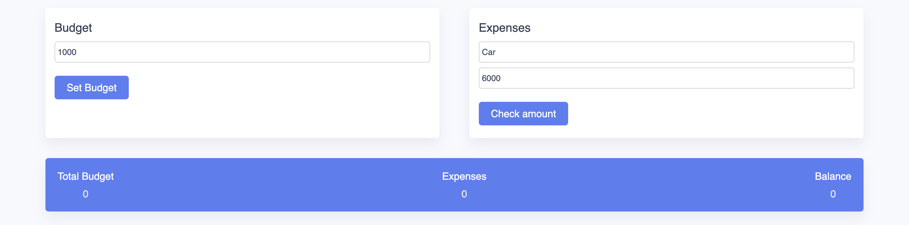
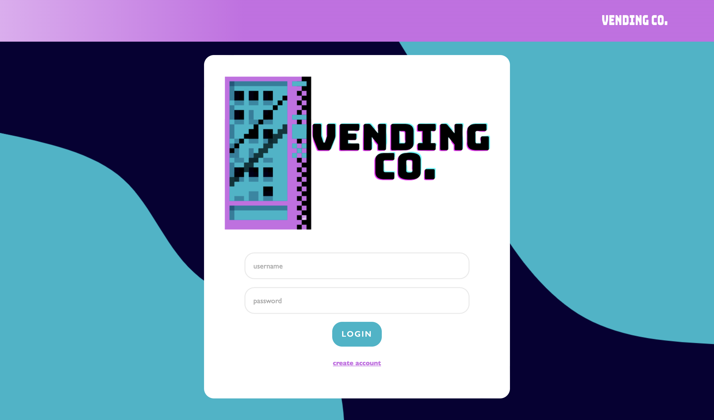
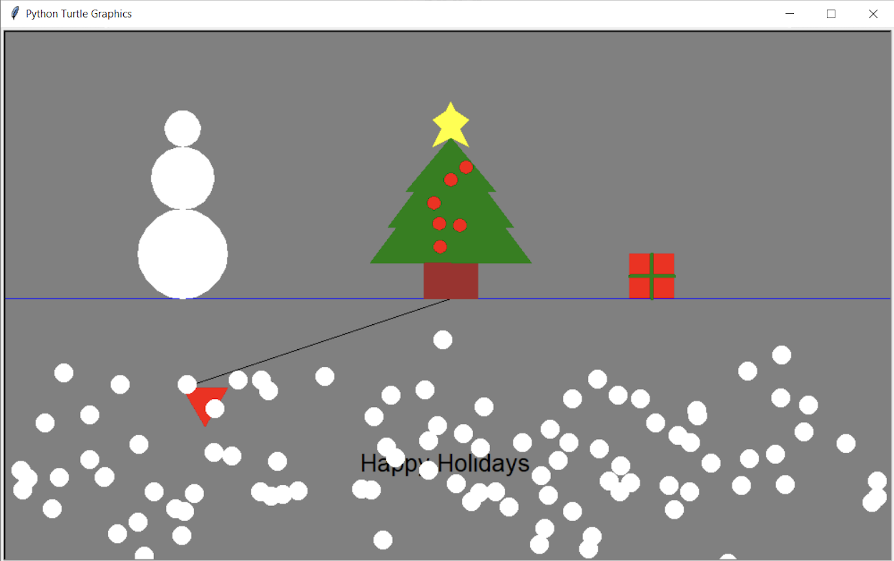
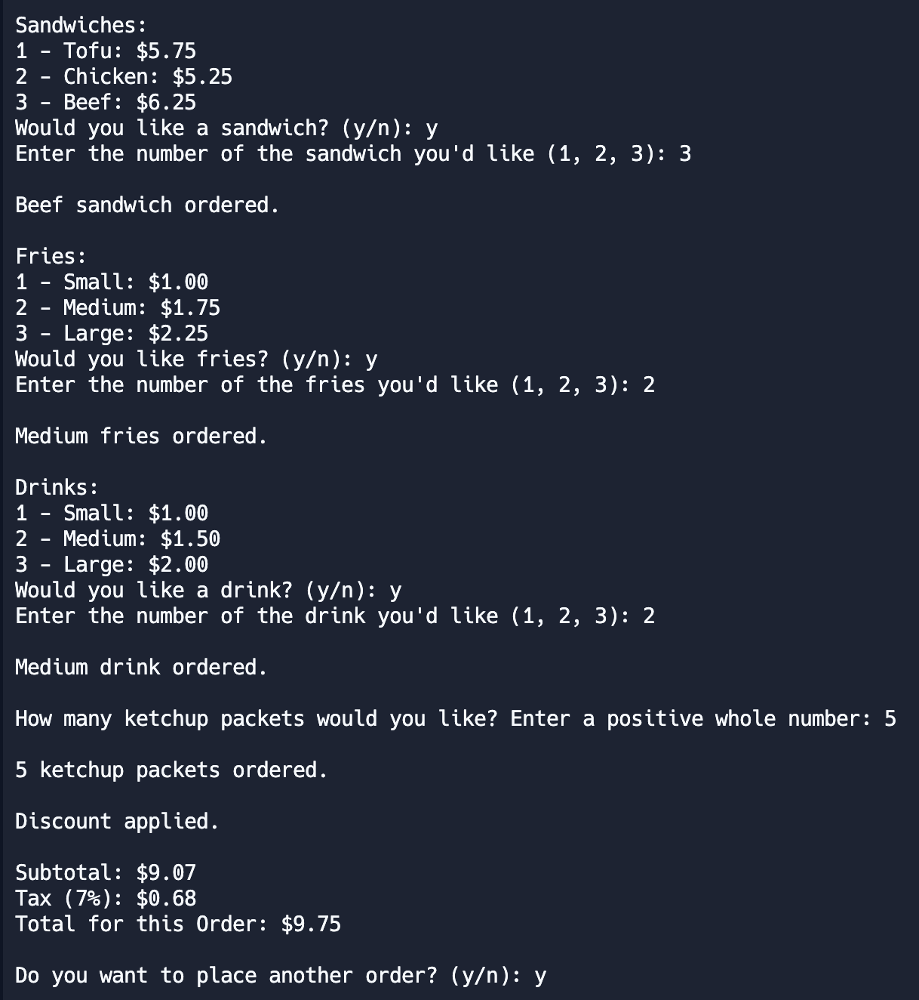
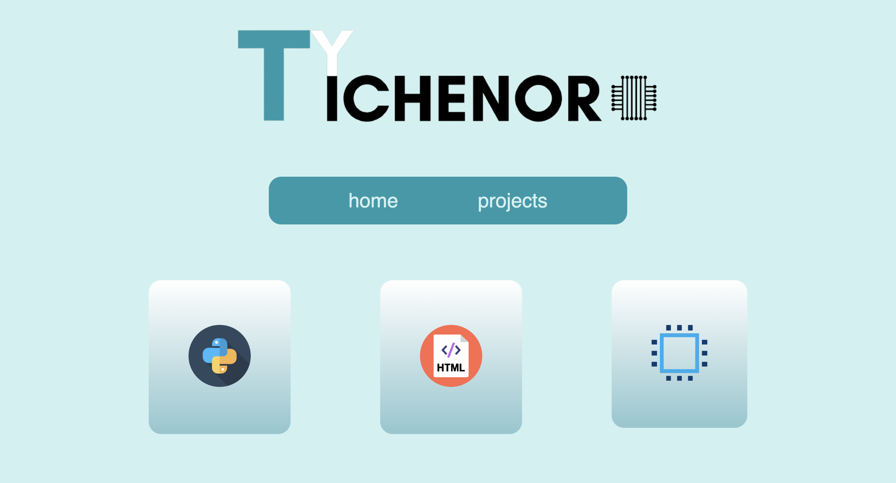
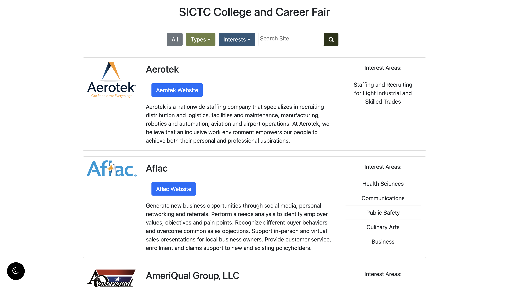
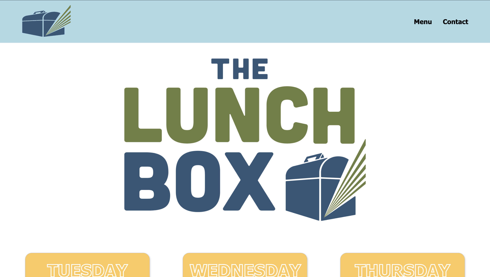
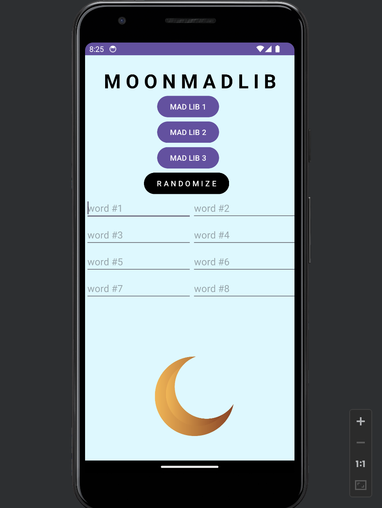

# Ty Tichenor 

### About Me
Hi, I'm Ty Tichenor. I'm currently a senior in high school at Gibson Southern. I attend the Southern Indiana Career & Technical Center for Computer Science. I am most interested in web development and I have experience in software development.

### Goals
Next year, I plan on attending USI and majoring in Computer Science. This year, I am looking forward to aquiring an internship to get started in the workplace and learn more skills. 

### Hobbies
For over 10 years, I have played for my archery club. In addition to that, I am in my local 4H club where I participate in photography and woodworking. Keeping up with new technology is an importatnt interest that I have as well. 

### ----- Featured Projects -----

### Budget Calculator
  
A webiste that allows for a budget calculator and lists items in the budget. 
  

### Vending Inventory Website
  
A webiste that displays items and options to manage the number of items in the inventory.
  

### Postcard
  
A python program that uses turtle graphics to diplay a holiday postcard. 
  

### Combo Menu Java
  
A java program that goes through a menu and allows for multiple orders. 
  

### Portfolio '23
  
My first portfolio website that displays some of my best work. 
  

### CCF Website
  
A website for the SICTC College & Career Fair that diplays the colleges and companies attending. 
  

### LunchBox Website
  
A website for The Lunchbox Resturaunt at SICTC that diplays the weekly menu and other information about the resturaunt. 
  

### Nav Kiosk
  
A webiste that diplays the SICTC map and allows for students at the open house to find their way to a classroom that they're interested in. 
  

### Mad Lib
  
An android app that has 8 inputs and can create 3 different Mad Libs.
  

### Social Links 
- https://www.linkedin.com/in/tytichenor
- https://github.com/tytichenor
- https://tytichenor.github.io/tytichenor-showcase-portfolio/
  

### Project Links
- https://sictccs.github.io/Lunchbox/
- https://sictccs.github.io/NavKiosk/
- https://sictccs.github.io/CCF/
